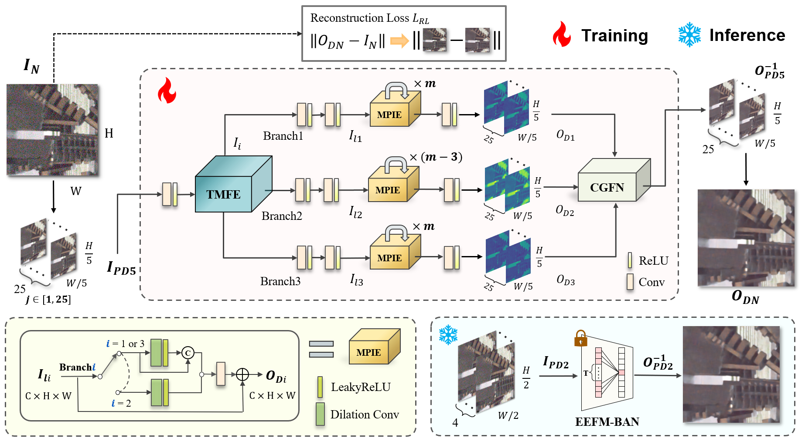
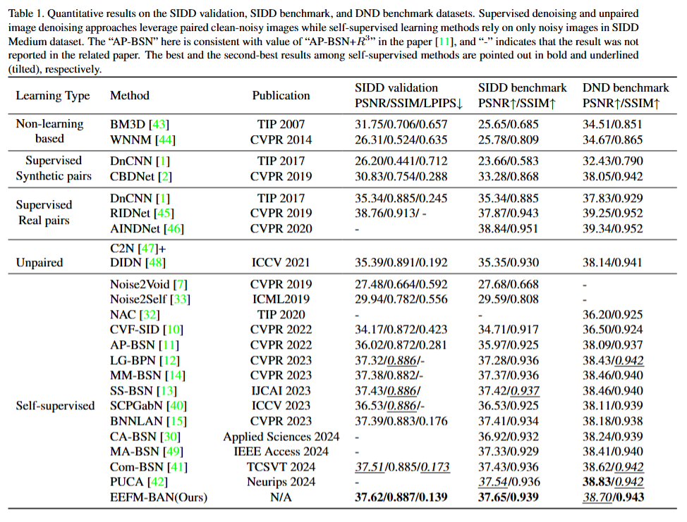
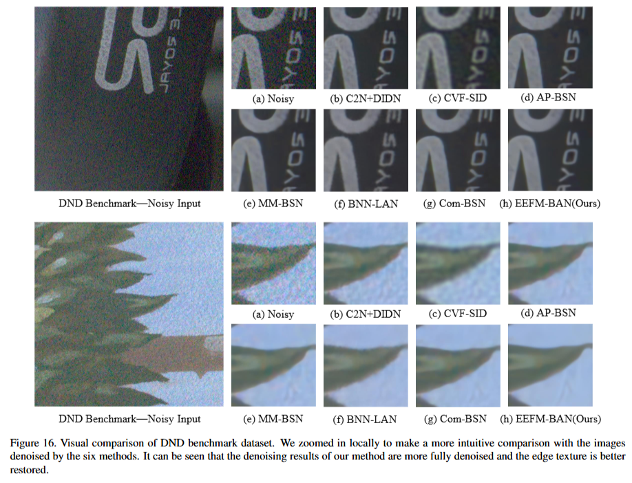

# Effective Enhancement and Fusion of Multi-Perspective Features for Self-Supervised Real Image Denoising




## Abstract
_In real-world self-supervised denoising tasks, understanding the noise distribution and its spatial correlation is crucial. Most of the existing methods employ pixel-shuffle downsampling (PD) to initially decouple the spatial connection of noise. However, an excessive PD stride will destroy the image structure when dealing with strongly correlated noise. This limitation leads to noise insufficient decorrelation, resulting in abnormal color spots and high-frequency detail loss. In this paper, we propose a Tri-Mask Feature Extraction (TMFE) module, which utilizes a parallel branch structure with predefined masks of different shapes that form blind-area to extract multi-perspective features, enabling the network to fully understand the noise distribution. Furthermore, we introduce the Multi-Pixel Information Enhancement (MPIE) module, which captures more neighborhood pixels to reconstruct blind-area and enhance local-global features, then preserve more high-frequency details. Cross-Gated Fusion Network (CGFN) uses cross-concatenation and gated weighting to eliminate redundant features and achieve complementary information fusion. Extensive experiments are conducted on SIDD and DND datasets, and our method achieves competitive performance, which improves denoising performance, preserves texture details, and mitigates aliasing artifacts._

---

## Setup

### Requirements

Our experiments are done with:

- Python 3.8.20
- PyTorch 1.8.2
- numpy 1.24.4
- opencv 4.10.0
- scikit-image 0.21.0

### Directory

Follow the below descriptions to build the code directory.

```
EEFM-BAN
├─ ckpt
├─ conf
├─ dataset
│  ├─ DND
│  ├─ SIDD
│  ├─ NIND
│  ├─ prep
├─ figs
├─ output
├─ src
```

### Dataset
- In this paper, we use SIDD validation, SIDD benchmark, DND benchmark datasets to evaluate performance:
  - SIDD validation and SIDD benchmark: https://www.eecs.yorku.ca/~kamel/sidd/
  - DND benchmark: https://noise.visinf.tu-darmstadt.de/

---

## Training & Test

### Training

```
# Train EEFM-BAN for the SIDD dataset using gpu:0
python train.py -c APBSN_SIDD -g 0
```

### Test

```
# Test SIDD dataset for 25 epoch model in gpu:0
python test.py -c APBSN_SIDD -g 0 -e 25
```

---

## Results

### Quantitative results

Here are the reported results of EEFM-BAN.



### Qualitative results

